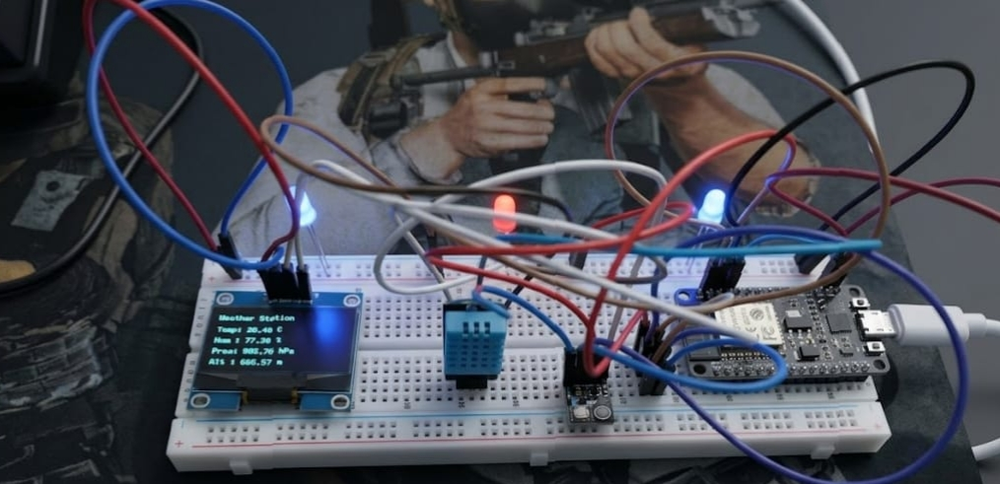
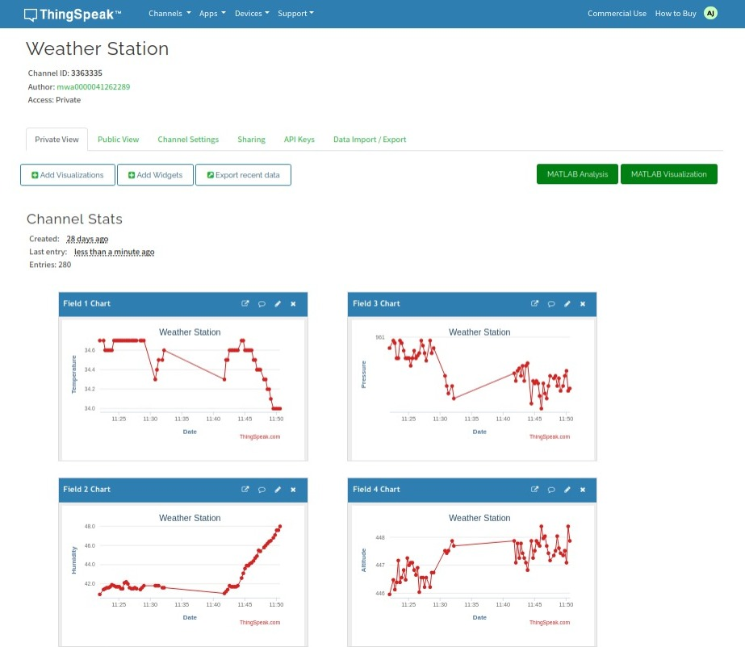

# IoT Based Weather Monitoring System

## Overview

This project is an advanced IoT-based Weather Monitoring System developed using NodeMCU ESP8266, DHT11, BMP180, and OLED display modules. The system is capable of collecting real-time environmental data including temperature, humidity, atmospheric pressure, and altitude, displaying it locally on an OLED screen, and transmitting the data to the ThingSpeak cloud platform for remote monitoring and analytics.

The project demonstrates the practical implementation of Internet of Things (IoT), embedded systems, wireless communication, cloud computing, and sensor interfacing technologies in a real-world monitoring solution.


# Problem Statement

Environmental monitoring plays a critical role in industries and sensitive operational environments. Sudden variations in temperature, humidity, or pressure can lead to:

* Equipment overheating
* Hardware failure
* Fire hazards
* Data center downtime
* Agricultural crop damage
* Pharmaceutical storage degradation
* Industrial process instability
* Laboratory environment contamination

Traditional monitoring systems are often expensive and difficult to deploy at scale. This project provides a low-cost, scalable, and cloud-enabled monitoring solution.


# Real-World Applications

This system can be deployed in multiple critical monitoring environments including:

## Industrial Monitoring

* Manufacturing plants
* Chemical industries
* Cold storage facilities
* Power plants

## Data Centers and Server Rooms

* Temperature and humidity monitoring
* Overheating prevention
* Equipment protection

## Healthcare and Laboratories

* Medicine storage rooms
* Vaccine refrigeration monitoring
* Research laboratories

## Disaster Monitoring Systems

* High altitude weather stations
* Flood-prone regions
* Environmental research centers

## Smart Homes and Buildings

* Indoor climate monitoring
* Smart HVAC automation
* Energy optimization systems

## Smart Agriculture

* Greenhouses
* Crop monitoring systems
* Soil and weather analysis stations

# Impact and Benefits

Continuous IoT-based environmental monitoring systems help organizations reduce operational risks and improve safety through real-time analytics and early anomaly detection.

Potential benefits include:

| Area                                            | Estimated Improvement   |
| ----------------------------------------------- | ----------------------- |
| Reduction in overheating-related failures       | Up to 40%               |
| Reduction in humidity-related equipment damage  | Up to 35%               |
| Faster anomaly detection and response           | Up to 60%               |
| Reduction in manual monitoring efforts          | Up to 70%               |
| Improvement in environmental data accessibility | Real-time remote access |

Note: Percentages vary depending on deployment environment, infrastructure quality, and alert automation systems.


# Features

* Real-time environmental monitoring
* Temperature measurement using DHT11
* Humidity measurement using DHT11
* Pressure and altitude monitoring using BMP180
* OLED live display output
* Cloud-based IoT monitoring using ThingSpeak
* Wi-Fi connectivity through ESP8266
* Real-time chart visualization
* Compact and portable architecture
* Expandable modular design
* LED and buzzer alert indicators


# Hardware Components

| Component       | Description                         |
| --------------- | ----------------------------------- |
| NodeMCU ESP8266 | Main IoT microcontroller with Wi-Fi |
| DHT11 Sensor    | Temperature and humidity sensor     |
| BMP180 Sensor   | Pressure and altitude sensor        |
| OLED Display    | Live sensor data display            |
| LEDs            | Status indicators                   |
| Buzzer          | Alert notifications                 |
| Breadboard      | Prototype assembly                  |
| Jumper Wires    | Electrical connections              |
| 5V Power Supply | System power source                 |


# Software and Technologies

* Arduino IDE
* Embedded C / Arduino Programming
* ESP8266 Wi-Fi Libraries
* ThingSpeak IoT Cloud Platform
* Adafruit SSD1306 OLED Library
* DHT Sensor Library
* BMP180 Sensor Library


# System Architecture

```text
Sensors (DHT11 + BMP180)
            │
            ▼
      NodeMCU ESP8266
            │
   ┌────────┴────────┐
   ▼                 ▼
OLED Display     ThingSpeak Cloud
(Local Output)   (Remote Analytics)
```


# Working Principle

1. DHT11 sensor captures temperature and humidity.
2. BMP180 sensor captures pressure and altitude.
3. NodeMCU processes sensor data in real time.
4. OLED screen displays live environmental readings.
5. ESP8266 Wi-Fi module uploads data to ThingSpeak cloud.
6. ThingSpeak generates live graphical charts for remote analysis.


# Hardware Setup

```html

```


# ThingSpeak Cloud Dashboard

```html

```


# Parameters Monitored

| Parameter            | Sensor |
| -------------------- | ------ |
| Temperature          | DHT11  |
| Humidity             | DHT11  |
| Atmospheric Pressure | BMP180 |
| Altitude             | BMP180 |


# Circuit Connections

## DHT11 Connections

| DHT11 Pin | NodeMCU |
| --------- | ------- |
| VCC       | 3.3V    |
| GND       | GND     |
| DATA      | GPIO    |


## BMP180 Connections

| BMP180 Pin | NodeMCU |
| ---------- | ------- |
| VCC        | 3.3V    |
| GND        | GND     |
| SDA        | D2      |
| SCL        | D1      |


## OLED Connections

| OLED Pin | NodeMCU |
| -------- | ------- |
| VCC      | 3.3V    |
| GND      | GND     |
| SDA      | D2      |
| SCL      | D1      |


# Installation and Setup

## Clone Repository

```bash
git clone https://github.com/buganalyst/weather_station.git
```


## Install Required Libraries

Install the following libraries from Arduino IDE:

* ESP8266WiFi
* ThingSpeak
* DHT Sensor Library
* Adafruit BMP085/BMP180 Library
* Adafruit SSD1306
* Adafruit GFX


## Configure Wi-Fi and ThingSpeak

Update credentials inside the Arduino code:

```cpp
const char* ssid = "YOUR_WIFI_NAME";
const char* password = "YOUR_WIFI_PASSWORD";

unsigned long channelID = YOUR_CHANNEL_ID;
const char* writeAPIKey = "YOUR_API_KEY";
```


## Upload the Code

* Select "NodeMCU 1.0 (ESP8266 Module)"
* Select the correct COM port
* Upload the `.ino` file using Arduino IDE


# Repository Structure

```text
├── Weather_Station.ino
├── README.md
├── thinkspeak.jpeg
├── weather_station.jpeg
```


# Future Enhancements

* Machine learning based weather prediction
* SMS and email alert integration
* Mobile application dashboard
* MQTT protocol integration
* Solar-powered deployment
* Rainfall and wind speed sensors
* AI-based anomaly detection
* Smart HVAC automation integration


# Research and Academic Value

This project demonstrates practical concepts in:

* Internet of Things (IoT)
* Embedded Systems
* Cloud Computing
* Wireless Communication
* Environmental Monitoring
* Real-Time Analytics
* Sensor Networks
* Smart Infrastructure


# License

This project is open-source and available under the MIT License.
